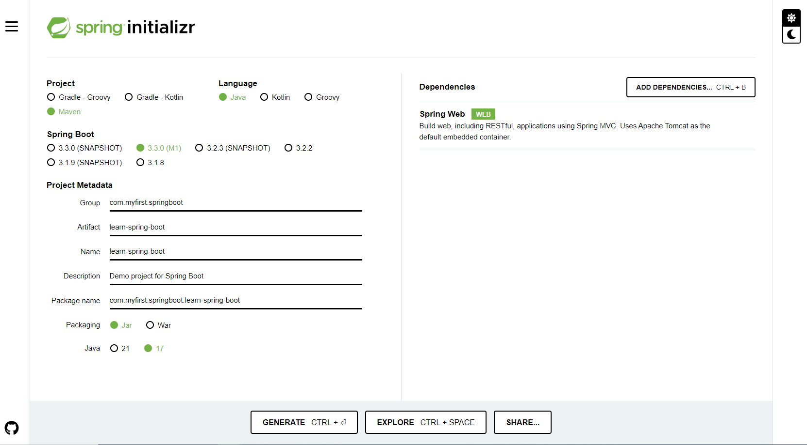

# Spring Boot
I am learning Spring Boot for that I am using "Learn Spring Boot 3 in 100 Steps - Beginner to Expert" by Packt Publishing in O'REALLY courses.

## 1. I learned how to set up Spring Boot
I am using:
* Java 17
* IntelliJ

I learned how to use Spring Initializr by navigating to this link:

[Spring Initializr link](https://start.spring.io/)

Here is the configuration I used, base on the course and, before I clicked on GENERATE CTRL + <-| button


Do NOT FORGET to add Spring Web in the Dependencies!

After we clicked on the GENERATE CTRL + <-| button and Zip file will be downloaded in our browser.
Then we will need to unZip the file an import into our IDE as new project.

## 2. I learned how to set up a response from a server
I used **@RestController** and **@RequestMapping("/yourPath")** annotations

See classes:
* CourseController
* Course

## 3. I learned about Spring Boot Starting Project
a) To build a **REST API**, I need:
* Spring
* Spring MVC
* Tomcat
* JSON conversion

b) To build a **Unit Tests**, I need:
* Spring Test
* JUnit / TestNG
* Mockito

But all of these are integrated within Spring Boot.

With Spring Boot, you can also build:
* Spring Boot Starter Data JPA
* Spring Boot Starter JDBC
* Spring Boot Starter Security - (REST API Secure)

## 4. I learned about Spring Boot Autoconfiguration
I learned from the Step 07 from O'REALLY course I mentioned on top

## 5. I learned about Sprig Boot DevTools
I learned that the main goal of this DevTools is to avoid user to stop the server and re-start it again. So each time a change happened in the code the server will re-star automatically.

To use is we need to import the Spring Boot DevTools dependence in our pom.xml file as shown in Step 08 from O'REALLY course I am following to learn Spring Boot.

## 6. I learned about Profiles
Profiles will help us to create different environments.

Environment example: 
* dev/rnd
* qa
* uat
* stage
* prod

Each environment will have a profile with different configuration.

To configure then we need to follow the next steps:
1. Navigate to "application.properties" (Path: src/main/resources)
2. Inside the file define the logger level by typing "logging.level.org.springframework=<yourDesireLoggerLevel>". There are different logger levels:
   * TRACE - It will print everything that is logged in all the levels
   * DEBUG - It will print a lot more information
   * INFO - It will print all the info in full level
   * WARNING - Similar to ERROR but with a bit more information
   * ERROR - Only error and exceptions will be logged
   * OFF - It will not record any logs
3. Copy and past "application.properties" renaming it adding "-environment" to the name. Ex.: "application **-dev**.properties" for a profile for dev environment.
5. For our project we have created 3 application.properties files for each environment 2 in our case:
   * application.properties - with "debug" logger level
   * application-dev.properties - for dev environment - with "trace" logger level
   * application-prod.properties - for prod environment - with "info" logger level
5. To create a profile in any of the properties file, we need to open "application.properties" and add: "spring.profiles.active=<myEnvironment>". In our example: "spring.profiles.active=prod" and whichever we configured in the "application.properties" will be used as configuration profile.

Check **"application.properties"** files:
* application.properties
* application-dev.properties
* application-prod.properties

## 7. I learned how to set complex profile configurations
1. We created in "application.properties" our desire properties. For our example we used (Open application.properties for more details):
   * currency-service.url=http://default.in28minutes.com
   * currency-service.username=defaultusername
   * currency-service.key=defaultkey
2. Then we created a new class "CurrencyServiceConfiguration" (Open CurrencyServiceConfiguration.java for more details) and performed the next steps:
   * We need to use @ConfigurationProperties()
   * Inside of the parenthesis, we will use a prefix with the name of the object of our configuration. For our example: "prefix="currency-service""
   * Inside of the class, we will create the different properties as private. For our example: url, username and key
   * We generate the getters and setter for our properties.
   * We add the annotation @Component in between our @ConfigurationProperties(prefix="currency-service") and the class
   * Now we can come back to our src/main/java/resources/application.properties file and add the values to the properties we created for this complex configuration
3. We duplicated CourseController with the name CurrencyController (Open CurrencyController.java for more details) and perform the next steps to retrieve the complex properties when user navigates to http://localhost:8080/currency-configuration
   * We use @RestController annotation
   * Our goal is to retrieve application.properties object information
   * We need to create a class "CurrencyServiceConfiguration" so we can instantiate the object from, define private properties and define getters and setters
   * We want to retrieve the properties information when we use http://localhost:8080/currency-configuration
     * To do that we use @Autowired annotation and define as private CurrencyServiceConfiguration
     * To do that we use @RequestMapping annotation on top of our method
     * Define next to the @RequestMapping annotation the folder like below. Example: @RequestMapping("/currency-configuration")
     * Return the values of configuration
   * Now to run it we need to run LearnSpringBootApplication class
   * Navigate to http://localhost:8080/currency-configuration
   * It will display application.properties object information

## 8. I learned about Spring Boot Embedded Servers
To embedded a server we need to do 2 things:
1. Install Java
2. Run JAR file

Let's focus on the step 2:
1. Let's generate the JAR file
   * In Intellij navigate to the right bar were Maven icon is display and click on it
   * Click on Lifecycle dropdown menu
   * Click on install. It will trigger a process that will generate our JAR file
   * In terminar, you will see that a location were the JAR file was created. Here is the example I got following the process:
   ```
   --- jar:3.3.0:jar (default-jar) @ learn-spring-boot ---
   [INFO] Building jar: C:\Users\eihc2\Desktop\SpringBoot\learn-spring-boot\target\learn-spring-boot-0.0.1-SNAPSHOT.jar
   ```
2. Let's run the server in our terminal
   * With the specific path for our project, look at previous last step, we open terminal and perform the next command to access the location of the file:
   ```
   cd C:/Users/eihc2/Desktop/SpringBoot/learn-spring-boot/target
   ```
   * After running the command we will access the folder where the JAR file is store. We can rul ls to verify that we are in the right location.
   * To run the JAR file we type this in the command line:
   ```
   java -jar learn-spring-boot-0.0.1-SNAPSHOT.jar
   ```
   * We will be able to initialize our server in our localhost8080